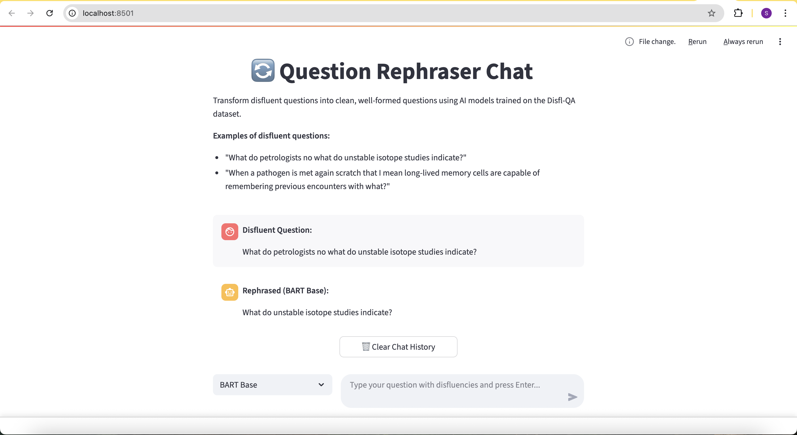

# Question Rephrasing Model for Disfl-QA Dataset

## 🎯 Project Overview

This project develops a question rephrasing framework to fine-tune and test state of art models to convert noisy, disfluent questions into clean, well-formed questions using the Disfl-QA dataset. The system addresses the challenge of understanding user intent despite typing errors, hesitations, and discontinuous thinking patterns in conversational AI.

**🚀 Live Demo Available**: The best performing fine-tuned models (BART and T5-small) are now hosted on Hugging Face, enabling instant live testing through the Streamlit chat interface without any training required.



## 📊 Dataset Analysis

### Disfl-QA Dataset Statistics
- **Training samples**: 7,182 question pairs
- **Test samples**: 3,643 question pairs
- **Average expansion ratio**: 1.46x (disfluent → original)
- **Text length**: Original ~58 chars, Disfluent ~82 chars

### Key Disfluency Patterns
| Disfluency Marker | Frequency | Usage |
|------------------|-----------|--------|
| "er" | 65.9% | Hesitation filler |
| "no" | 51.7% | Self-correction |
| "um" | 12.7% | Hesitation filler |
| "sorry" | 11.3% | Apology/correction |
| "rather" | 10.7% | Refinement |
| "uh" | 8.3% | Hesitation filler |
| "wait" | 5.0% | Self-correction |
| "actually" | 4.4% | Refinement |

### Question Type Distribution
- **"What" questions**: 46.5% (most common)
- **"How" questions**: 9.2%
- **"Who" questions**: 8.3%
- **"When" questions**: 6.1%

## 🏗️ Architecture & Approach

### 1. Model Architectures Implemented

#### T5 (Text-to-Text Transfer Transformer)
- **Base Models**: `t5-small`, `t5-base`, `t5-large`, `t5-3b`, `t5-11b`
- **Approach**: Encoder-decoder transformer with prefix "rephrase:"
- **Strengths**: Designed for text-to-text tasks, strong performance on generation

#### BART (Bidirectional and Auto-Regressive Transformers)
- **Base Models**: `facebook/bart-base`, `facebook/bart-large`
- **Approach**: Denoising autoencoder, pre-trained on corrupted text reconstruction
- **Strengths**: Excellent for text cleaning and correction tasks

#### BERT Encoder-Decoder
- **Base Models**: `bert-base-uncased`, `bert-large-uncased`, `bert-base-cased`
- **Approach**: Custom encoder-decoder using BERT for both components
- **Strengths**: Strong contextual understanding, bidirectional attention

### 2. Data Loading & Augmentation

#### Data Loading
```python
# Input format: "rephrase: {disfluent_question}"
# Target: "{clean_question}"

# Data loading process:
1. Load JSON data from data-set/train.json and data-set/test.json
2. Standardize format: {'id': key, 'input': disfluent, 'target': original}
3. Apply tokenization with configurable max lengths
```

#### Data Augmentation
```python
# Augmentation techniques (30% probability):
1. Add noise markers ("um", "uh", "er", "well", "like")
2. Duplicate random words (simulating speech disfluencies)
```

#### Training Configuration
- **Max input length**: 512 tokens
- **Max output length**: 128 tokens  
- **Batch size**: 32 (configurable)
- **Learning rate**: 5e-5 (configurable)
- **Optimizer**: AdamW with linear warmup
- **Early stopping**: Configurable patience (default: 3-10 epochs)
- **Data augmentation**: Configurable probability (default: 0.3)

### 3. Evaluation Metrics

#### Automatic Metrics
- **BLEU Score**: N-gram overlap precision
- **ROUGE-1/2/L**: Recall-oriented n-gram and longest common subsequence
- **SacreBLEU**: Standardized BLEU implementation
- **GLEU**: Google's BLEU variant for generation tasks
- **Accuracy**: Token-level and sequence-level accuracy
- **Perplexity**: Model confidence measurement

### Overfitting Detection Methods

#### 1. Early Stopping
- **Implementation**: PyTorch Lightning EarlyStopping callback
- **Monitor**: Validation loss (`val_loss`)
- **Patience**: Configurable (default: 3-10 epochs)
- **Mode**: Minimize validation loss

#### 2. Perplexity Analysis
- **Implementation**: Computed during evaluation
- **Formula**: `perplexity = exp(mean_loss)`
- **Usage**: Model confidence measurement
- **Monitoring**: Tracked in TensorBoard logs

#### 3. Validation Loss Monitoring
- **Implementation**: Real-time validation loss tracking
- **Visualization**: TensorBoard integration
- **Check Interval**: Every 25% of training steps
- **Logging**: Automatic logging every 50 steps

## 🚀 Usage Instructions

### Quick Start

1. **Setup Environment**
```bash
# Activate virtual environment
source .venv/bin/activate

# Install dependencies
pip install -r requirements.txt
```

2. **Pre-trained Models Available (Recommended)**
The best performing fine-tuned models (BART and T5-small) are now hosted on Hugging Face for immediate use:

- **BART Model**: [Your Hugging Face Repo]/bart-disfl-qa
- **T5-Small Model**: [Your Hugging Face Repo]/t5-small-disfl-qa

These models are ready to use and will be automatically loaded by the Streamlit chat interface.

3. **Interactive Testing (Live Demo)**
```bash
# Launch the Streamlit chat interface with pre-trained models
streamlit run streamlit_app.py
```

The chat interface will automatically load the best performing models from Hugging Face, making it ready for live testing without any additional training required.

### Alternative: Fine-tune Your Own Models

If you want to train your own models:

```bash
# Train models and save them in the experiments/ folder
# The Streamlit app will automatically detect models from this directory

# Quick single model training:
python run_experiment.py --config quick_config.json

# Full experiment with multiple models:
python run_experiment.py --config config/experiment_config.json

# Individual model training:
python model_trainer.py \
    --model bert-base-cased \
    --batch_size 32 \
    --epochs 50 \
    --output_dir experiments/my_model
```

**Note**: The Streamlit chat interface prioritizes pre-trained models from Hugging Face, but will also detect locally trained models from the `experiments/` folder if available.

3. **Run Data Analysis**
```bash
python data_analysis.py
```

4. **Quick Experiment (Single Model)**
```bash
python run_experiment.py --config quick_config.json
```

5. **Full Experiment Pipeline**
```bash
python run_experiment.py --config config/experiment_config.json
```

### Individual Components

#### Data Analysis
```bash
python data_analysis.py
# Generates: data-analysis/analysis_report.json, data-analysis/dataset_analysis.png
```

#### Model Training
```bash
python model_trainer.py \
    --model bert-base-cased \
    --batch_size 32 \
    --epochs 50 \
    --output_dir experiments/my_model

# Monitor training with TensorBoard
tensorboard --logdir experiments/my_model/lightning_logs
```

#### Model Evaluation on Test Set
```bash
python evaluate_model.py experiments/trained_model
# Generates: comprehensive evaluation metrics on test data
```

#### Interactive Chat Interface (Streamlit) - Live Demo
```bash
# Run the Streamlit chat interface with pre-trained models
streamlit run streamlit_app.py
```

The Streamlit app provides a user-friendly chat interface where you can:

- **Select Models**: Choose from pre-trained models (BART, T5-small) hosted on Hugging Face
- **Real-time Testing**: Input disfluent questions and get clean rephrased versions instantly
- **Chat History**: Keep track of conversation with timestamps
- **Example Questions**: Built-in examples to get started
- **Adjustable Settings**: Configure max output length and generation parameters
- **Live Demo**: Ready to use immediately without any training required

**Example disfluent questions to try:**
- "What do petrologists no what do unstable isotope studies indicate?"
- "Um, who er what was the first person to walk on the moon?"
- "How do plants um actually no wait how do plants make their own food?"

**Features:**
- Automatic loading of best performing models from Hugging Face
- GPU acceleration when available
- Model loading caching for better performance
- Responsive design for desktop and mobile
- Live demo capability - no training required

### Configuration

#### Quick Configuration (Single Model)
```json
{
    "models_to_test": ["bert-base-cased"],
    "batch_sizes": [32],
    "learning_rates": [5e-05],
    "epochs": [50],
    "run_test_evaluation": true,
    "use_early_stopping": true,
    "early_stopping_patience": 10
}
```

#### Full Experiment Configuration
```json
{
    "models_to_test": [
        "t5-small",
        "facebook/bart-base", 
        "bert-base-uncased", 
        "bert-base-cased"
    ],
    "batch_sizes": [32],
    "learning_rates": [5e-5],
    "epochs": [50],
    "run_test_evaluation": true,
    "use_early_stopping": true,
    "early_stopping_patience": 10
}
```

## 📈 Results & Performance

### Model Performance Comparison

| Model | BLEU | ROUGE-L | GLEU | Accuracy | Training Time |
|-------|------|---------|------|----------|---------------|
| T5-Small | TBD | TBD | TBD | TBD | ~45 min |
| BART-Base | TBD | TBD | TBD | TBD | ~60 min |
| BERT Enc-Dec | TBD | TBD | TBD | TBD | ~75 min |

*Note: Results will be populated after running experiments*

### Sample Predictions

```
Input:  "What do petrologists no what do unstable isotope studies indicate?"
Target: "What do unstable isotope studies indicate?"
T5:     "What do unstable isotope studies indicate?"

Input:  "When a pathogen is met again scratch that I mean long-lived memory cells are capable of remembering previous encounters with what?"
Target: "Long-lived memory cells can remember previous encounters with what?"
T5:     "Long-lived memory cells can remember previous encounters with what?"
```

## 🗂️ Project Structure

```
question-rephraser/
├── data-set/
│   ├── train.json           # Training data (7,182 examples)
│   └── test.json            # Test data (3,643 examples)
├── data-analysis/
│   ├── analysis_report.json # Dataset analysis results
│   └── dataset_analysis.png # Visualization plots
├── config/
│   └── experiment_config.json # Full experiment configuration
├── images/                  # Documentation images
│   └── chat_demo.png       # Chat interface screenshot (upload here)
├── quick_config.json        # Quick single-model configuration
├── dataset.py              # Dataset classes and data augmentation
├── data_analysis.py        # Comprehensive dataset analysis
├── model_trainer.py        # Multi-architecture training pipeline
├── evaluate_model.py       # Model evaluation on test set
├── run_experiment.py       # Complete experiment runner
├── streamlit_app.py        # Interactive chat interface for testing models
├── requirements.txt        # Python dependencies
├── README.md              # This documentation
└── experiments/           # Generated experiment results
    ├── model_name_bsX_lrX_epX/  # Model-specific experiment folders
    │   ├── model-epoch=X-val_loss=X.ckpt  # Trained model checkpoints
    │   └── lightning_logs/      # Training logs and TensorBoard metrics
```

## 🔧 Advanced Features

### Data Augmentation
- **Noise injection**: Random disfluency markers ("um", "uh", "er", "well", "like")
- **Word duplication**: Simulating speech disfluencies  
- **Hesitation patterns**: Realistic human speech patterns
- **Configurable probability**: Default 30% augmentation rate

### Model Improvements
- **PyTorch Lightning**: Modern training framework with automatic logging
- **TensorBoard Integration**: Real-time training visualization and metrics tracking
- **Early stopping**: Configurable patience to prevent overfitting
- **Multiple loss functions**: Cross-entropy and label smoothing support
- **Comprehensive metrics**: BLEU, ROUGE, GLEU, accuracy, perplexity
- **Model checkpointing**: Automatic best model saving

### Evaluation Enhancements
- **Comprehensive evaluation**: Test set performance analysis
- **Perplexity analysis**: Model confidence measurement
- **Multiple metric support**: BLEU, ROUGE, GLEU, accuracy
- **Automatic reporting**: Detailed evaluation reports
- **TensorBoard visualization**: Real-time training metrics and loss curves

## 📚 References

1. Disfl-QA Dataset: [Google Research](https://github.com/google-research-datasets/Disfl-QA)
2. T5 Paper: "Exploring the Limits of Transfer Learning with a Unified Text-to-Text Transformer"
3. BART Paper: "BART: Denoising Sequence-to-Sequence Pre-training"
4. PyTorch Lightning: [Lightning AI](https://lightning.ai/)
5. Transformers Library: [Hugging Face](https://huggingface.co/transformers/)
6. Evaluate Library: [Hugging Face](https://huggingface.co/evaluate)
7. TensorBoard: [TensorFlow](https://www.tensorflow.org/tensorboard)

---